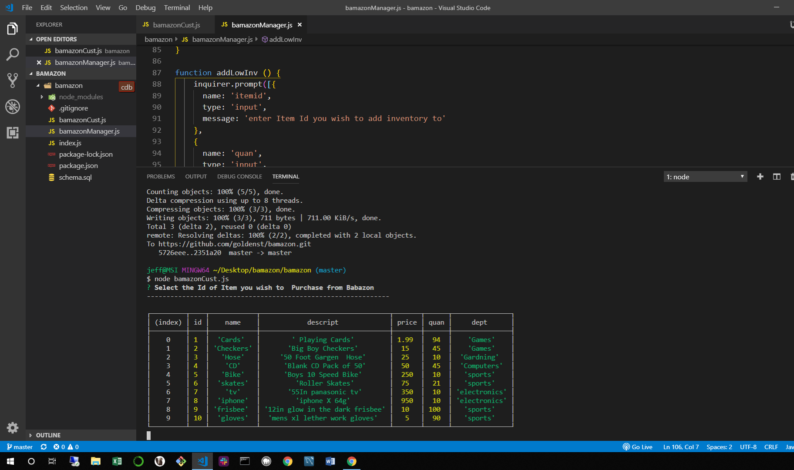

# bamazon

# CLI STORE APP

on start up the app will display all products in store

it then asks you to select an item by id to purchase
then it will check the quanity in the db and if there is not enoughf there it will prompt you to select a smaller amount

after suscessful purchase app will display the cost of purchase
update the database to the correct quanity

